# ***Agentic AI Knowledge Chat***

A Retrieval-Augmented Generation (RAG) based AI chatbot that answers user queries strictly based on the **provided Agentic AI eBook**.  
The system uses vector similarity search and a controlled generation pipeline to ensure grounded, document-based responses.

## ***Live Demo***
#### **Deployed Streamlit Application:**
https://agentic-ai-knowledge-chat.streamlit.app

**Note:** If the app is sleeping due to inactivity, please turn it on.

## ***Overview***

This project implements RAG (Retrieval Augmented Generation) pipeline using:
+ **FAISS** for vector similarity search.
+ **SentenceTransformers** for text embeddings.
+ **LangGraph** for orchestrating retrieval and generation.
+ **Groq LLM** for response generation.
+ **Streamlit** for the interactive UI.

The chatbot answers questions only using the content of the Agentic AI eBook and provides:

+ Final answer
+ Retrieved context chunks
+ A confidence score


## ***Setup Instructions***

### ***1. Clone the Repository***
```bash
git clone <your-repository-url>
cd agentic-ai-rag-chatbot
```

### ***2. Create and Activate Virtual Environment***
```bash
python -m venv .venv
source .venv/bin/activate    # Windows: .venv\Scripts\activate
```

### ***3. Install Dependencies***
```bash
pip install -r requirements.txt
```

### ***4. Configure Environment Variables***
```bash
GROQ_API_KEY=your_groq_api_key_here
```

## ***Data Ingestion (one time only)***
The FAISS index is already included in the repository.  
If you want to regenerate it:
```bash
python app/ingest.py  # From the root directory
```

## ***FastAPI Backend***
The FastAPI backend is implemented and fully functional, but is intended to be run locally.

Run locally:
```bash
uvicorn app.api:app --reload
```

Swagger UI:
```bash
http://localhost:8000/docs
```
### ***Why the API is used locally only:***

#### **1. Testing and Validation**
+ The API allows structured testing of the RAG pipeline (/chat endpoint).

+ Useful for debugging retrieval, grounding, and confidence scoring.

#### **2. Deployment Constraints**
+ Deploying the FastAPI backend with local embeddings and FAISS exceeds the 512 MB memory limit on free-tier Render.

+ Render’s paid tier supports this setup, but for this assignment, a Streamlit-only deployment was chosen for simplicity and cost efficiency.

The deployed Streamlit app directly hosts the RAG pipeline, while the API remains available for local evaluation.


## ***Sample Queries***

**Q1. Explain Agentic AI in detail**

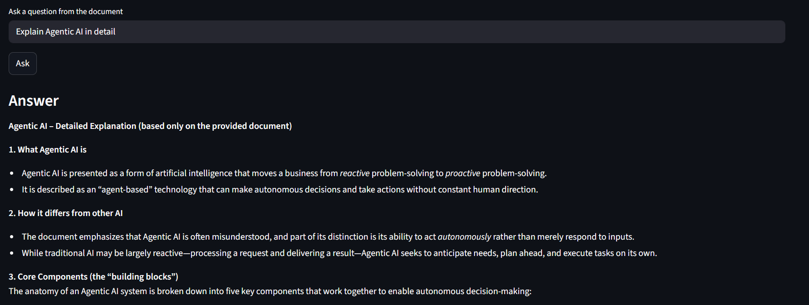
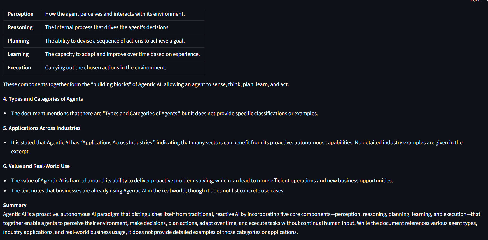
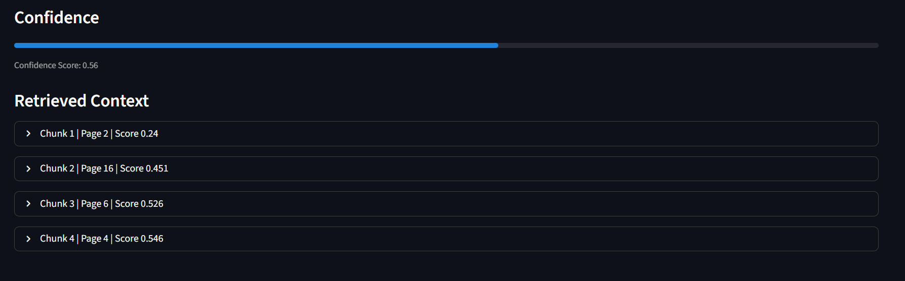

**Q2. How does Agentic AI differ from traditional AI systems?**

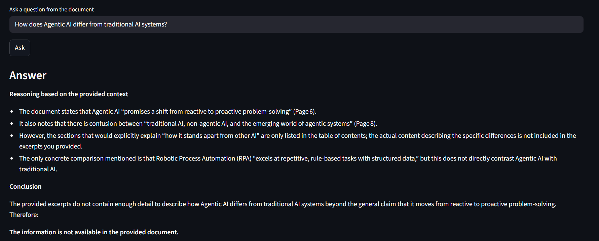
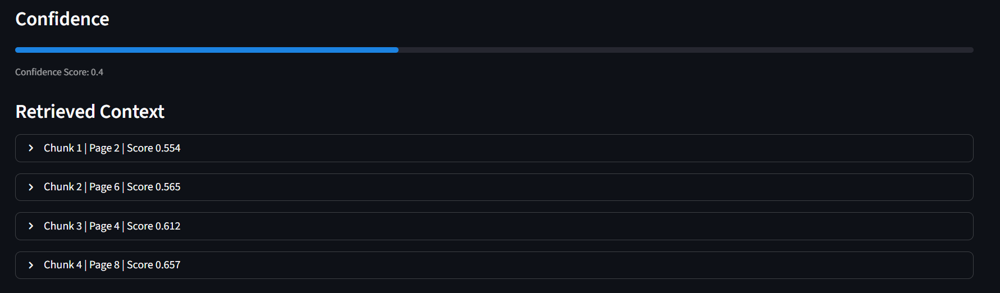

**Q3. What are the core components of an agentic system?**

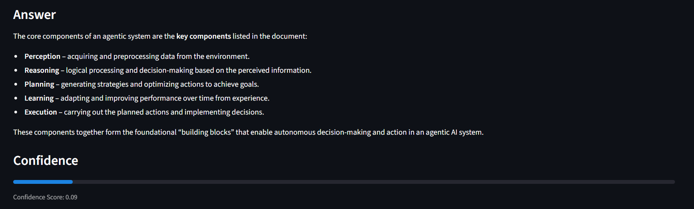
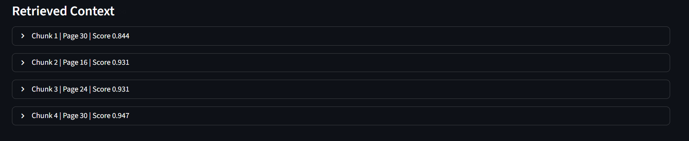

**Q4. What are the core components of an agentic system?**

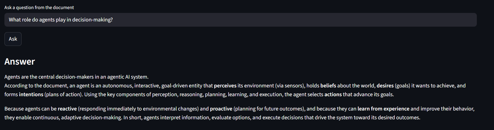
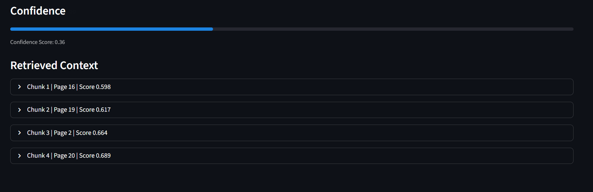

**Q5. What are some applications of Agentic AI?**

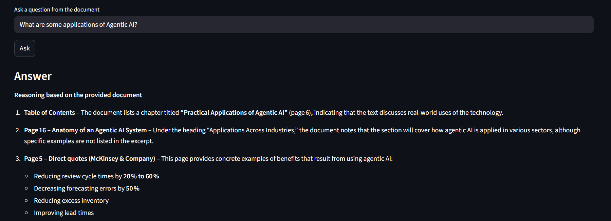
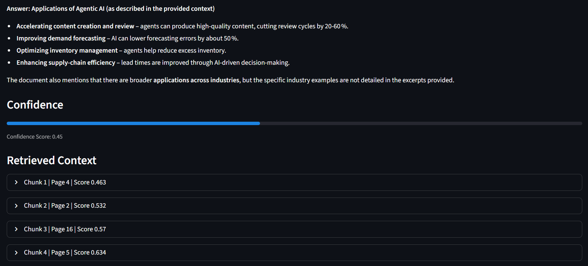

## ***Key Features***

+ Grounded answers strictly from the document

+ Transparent retrieval with context chunks
+ Confidence score for each response
+ Clean and interactive UI
+ Modular architecture (easy to extend or swap components)

## ***Notes***

+ The knowledge base PDF is included for reproducibility.

+ The FAISS index is precomputed and committed to avoid runtime ingestion.

+ The architecture is modular and can easily be extended to a managed vector database for production use.